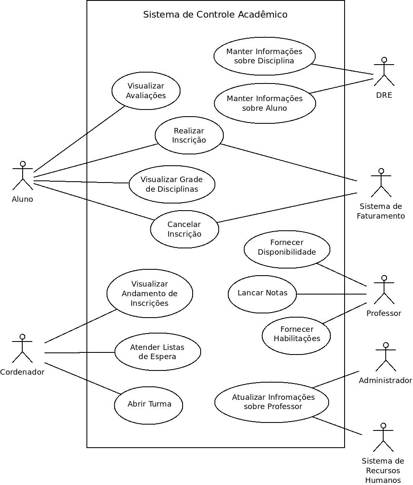

# SIGUNI
Sistema de Gerenciamento Acadêmico desenvolvido em Java como aplicação prática do conteúdo do livro Princípios de Análise e Projeto de Sistemas com UML (Bezerra)

## Requisitos do Sistema

R1. O sistema deve permitir que alunos visualizem as notas obtidas por semestre letivo.

R2. O sistema deve permitir o lançamento das notas das disciplinas lecionadas em um semestre letivo e controlar os prazos e atrasos neste lançamento.

R3. O sistema deve manter informações cadastrais sobre disciplinas no currículo escolar.

R4. O sistema deve permitir a abertura de turmas para uma disciplina, assim como a definição de salas e laboratórios a serem utilizados e dos horários e dias da semana em que haverá aulas de tal turma.

R5. O sistema deve permitir que os alunos realizem a inscrição em disciplinas de um semestre letivo.

R6. O sistema deve permitir o controle do andamento das inscrições em disciplinas por alunos.

R7. 0 sistema deve se comunicar com o Sistema de Recursos Humanos para obter dados cadastrais sobre os professores.

R8. O sistema deve se comunicar com o Sistema Financeiro para informar as inscrições realizadas pelos alunos.

R9. O sistema deve manter informações cadastrais sobre os alunos e sobre seus históricos escolares.

## Diagramas de Casos de Uso

